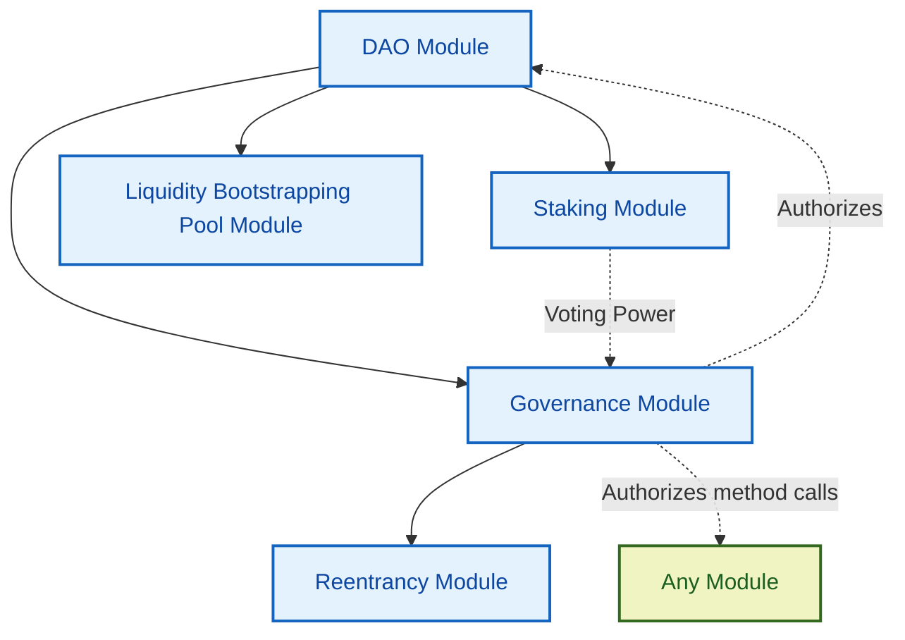

# Free and Open Source DAO Creator

**DAOpensource** is an open source Scrypto package that allows for the creation of a DAO and governing of any other Radix DLT on-chain component. It consists of:

1. **DAO Component**: Manages the DAO's treasury, distributes jobs and airdrops, and holds official DAO information.

2. **Governance Component**: Handles proposal creation, voting, and execution. It holds badges to authorize method calls suggested in proposals.

3. **Staking Component**: Allows users to stake the DAO's governance token to a Membership ID NFT to be able to vote on proposals, and receive staking rewards.

4. **Incentives Component**: Allows users to stake any accepted token to a Staking ID NFT, to receive periodic rewards. The DAO can add incentivized resources through proposals.

5. **ReentrancyProxy Component**: Facilitates method calls that require reentrancy (sometimes required in the execution of proposals), which is challenging in the Radix Engine.

6. **Bootstrap Component**: Optionally creates a Liquidity Bootstrapping Pool (LBP) to distribute the DAO's governance token at launch.

### Governance Process

The Governance component is central to the DAO's operations, allowing users to create proposals, vote on them, and execute approved proposals. This process involves:

- Building proposals using ProposalSteps
- Submitting proposals using Proposal Receipts
- Voting on proposals using Staking IDs
- Executing approved proposals, which carries out each step in the proposal

The DAO can govern any number of components by executing authorized method calls on them, allowing for flexible control over the Stabilis protocol and potentially other systems.

## Creating a DAO

Deploying a DAO using this package is fairly simple:

1. Instantiate the DAO module. The instantiator should pre-mint and provide the DAO's governance tokens and admin badge.
2. The DAO module automatically instantiates the Staking module.
3. The DAO module automatically instantiates the Governance module.
4. The Governance module automatically instantiates the Reentrancy module.
5. The DAO module automatically instantiates the Liquidity Bootstrapping Pool module.

Here's a diagram representing the resulting DAO's components and their interactions, including its ability to authorize method calls on any module:

Once the DAO is deployed, it can be set up to govern any component. This connection allows the DAO to govern the STAB module through authorized method calls. For this to work, deposit the admin badge(s) of the to be governed component(s) into the Governance Component's Vault.

## Disclaimer

This package is made for research purposes only. In production use of this package is discouraged. Stabilis Labs is not responsible for or affiliated with any deployments of this package.

